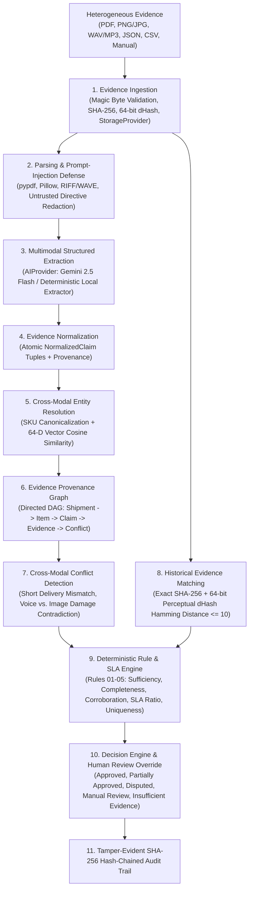

# EvidenceOS — AI Evidence Verification Engine (`VeriDock`)

> **Positioning:** An AI evidence verification engine for high-stakes business decisions.  
> **First Vertical Application:** **VeriDock** — Multi-modal B2B delivery and procurement dispute resolution.

[](LICENSE)
[](#quick-start)
[](#architecture)
[](#ui-overview)

---

## 1. Project Overview: EvidenceOS vs. VeriDock

- **EvidenceOS** is the underlying horizontal **evidence intelligence platform**. It ingests heterogeneous evidence (PDFs, images, audio recordings, JSON, CSV, manual statements), enforces cryptographic and perceptual provenance, normalizes cross-modal claims, resolves entities, surfaces contradictions, and evaluates deterministic rules.
- **VeriDock** is the first vertical product built on top of EvidenceOS, focused on **B2B delivery and procurement disputes**.

---

## 2. The Problem & Why It Matters

B2B supply chain and procurement disputes routinely stall millions of dollars in working capital because evidence is fragmented across incompatible modalities:
- **Purchase Orders (PDF/JSON)** issued by procurement
- **Delivery Challans / Packing Slips (PDF/CSV)** signed at dispatch or receiving
- **Dock Inspection Photographs (PNG/JPEG)** taken on warehouse mobile devices
- **Voice Reports (WAV/MP3)** recorded by unloading supervisors during dock intake
- **Historical Dispute Claims** and **Contract SLA Rules**

Manual reconciliation causes slow dispute resolution, human error, inconsistent payout adjustments, duplicate/reused photo claims, and opaque audit trails. Generic LLM chatbots fail in this domain because they hallucinate visual details, average out conflicting numbers, and cannot guarantee deterministic contract arithmetic.

---

## 3. Core Epistemological Principle

**Never allow an LLM to silently invent facts.**

Every claim and conclusion in EvidenceOS carries a mandatory [`Provenance`](core/schemas.py) record (`evidence_id`, `source_type`, `document_role`, `location`, `extraction_method`, `timestamp`, `confidence`, `raw_snippet`) and is classified into one of four explicit epistemological types:

| Epistemological Type | Meaning | Example in VeriDock |
| :--- | :--- | :--- |
| **`FACT`** | Directly extracted from a single piece of primary evidence ($\text{confidence} \ge 0.75$) | Purchase Order `PO-2026-1001` (`page:1`) states `ordered_quantity = 10` for `SKU-IND-100`. |
| **`INFERENCE`** | Derived by linking multiple pieces of evidence across modalities | Connecting `PO-2026-1002`, `DC-2026-1002`, `dock_photo_case2_2damaged.png`, and `dock_voice_case2.wav` to canonical entity `ITEM:SKU-IND-100`. |
| **`RULE`** | Determined by explicit deterministic Python business logic | `RULE_04_CONTRACT_SLA_THRESHOLD`: Damage ratio $2/10 = 20\% \le 25\%$ (`PASS`); buyer credit $= 2 \times \$250 = \$500.00$. |
| **`UNCERTAINTY`** | Insufficient, low-confidence ($< 0.75$), or conflicting evidence | Case 3 Voice claims `5` damaged units vs. Image shows `2` damaged units; Case 5 obstructed photo has `confidence = 0.45`. |

---

## 4. Architecture & 12-Stage Pipeline



### AI vs. Deterministic Separation

- **AI Tasks (`core/ai/`, `core/extraction/`)**: Multimodal document parsing, visual damage/packaging observation, speech-to-claim extraction, and semantic token embeddings.
- **Deterministic Tasks (`core/rules/`, `core/decisions/`, `core/matching/`, `core/audit/`)**: All quantity arithmetic, payout calculations, SLA ratio checks, SHA-256 & 64-bit perceptual dHash comparisons, and hash-chained audit logging.

---

## 5. Canonical Demo Cases (Seeded Out-of-the-Box)

On startup (or via `python -m scripts.seed_demo`), EvidenceOS generates and processes 5 realistic multimodal B2B dispute cases with real PDF documents, PNG inspection photos, and WAV audio reports in [`datasets/synthetic_cases/`](datasets/synthetic_cases/):

| Case ID | Scenario | PO | Challan | Image Evidence | Voice Report | Conflicts / Warnings | Expected & Actual Decision |
| :--- | :--- | :---: | :---: | :---: | :---: | :--- | :--- |
| **`case_01_clean_delivery`** | Clean delivery | 10 | 10 | 10 intact, 0 dmg | 0 damaged | 0 conflicts | **`approved`** |
| **`case_02_partial_damage`** | Legitimate partial damage | 10 | 10 | 2 crushed boxes | 2 damaged | 0 conflicts | **`partially_approved`** (\$500 credit) |
| **`case_03_conflicting_evidence`** | Conflicting evidence | 10 | 8 | 2 damaged | 5 damaged | 2 conflicts (`SHORT_DELIVERY_MISMATCH`, `DAMAGE_QUANTITY_CONTRADICTION`) | **`manual_review_required`** |
| **`case_04_reused_evidence`** | Reused historical photo | 10 | 10 | Perturbed copy of Case 2 photo | 2 damaged | Historical dHash match (`98.4%` similarity, Hamming dist `1/64`) | **`manual_review_required`** (*"Potentially reused evidence detected."*) |
| **`case_05_insufficient_evidence`** | Weak / blurry evidence | 10 | 10 | Low-clarity photo (`conf=0.45`) | 4 damaged | 1 conflict (`INSUFFICIENT_VISUAL_CORROBORATION`) | **`manual_review_required`** |

---

## 6. Quick Start & Installation

### Option A: Local Development (Python 3.12+ & Node 22+)

1. **Install Backend & Run Tests**:
   ```bash
   python -m pip install -e ".[dev]"
   cp .env.example .env
   python -m pytest -v
   ```

2. **Start the FastAPI Backend** (automatically initializes SQLite/PostgreSQL and seeds all 5 canonical cases):
   ```bash
   python -m uvicorn apps.api.app.main:app --host 127.0.0.1 --port 8000 --reload
   ```
   OpenAPI Docs available at `http://127.0.0.1:8000/docs`.

3. **Start the React + TypeScript Frontend**:
   ```bash
   cd apps/web
   npm install
   npm run dev
   ```
   Open `http://localhost:5173` in your browser.

### Option B: Docker Compose (PostgreSQL + `pgvector` + FastAPI + Nginx React Web)

```bash
docker compose up --build
```

---

## 7. Empirical Evaluation Results

Run the reproducible benchmark harness directly from the command line:

```bash
python -m evaluation.runner
```

Measured output across the 5 canonical multimodal cases (`20` binary PDF, PNG, and WAV files):

| Metric | Measured Result |
| :--- | :--- |
| **Extraction Accuracy** | `100.0%` (`20/20` files) |
| **Field-Level Accuracy** | `100.0%` (`15/15` core quantity fields) |
| **Entity Matching Accuracy** | `100.0%` (`5/5` cross-modal SKU resolutions) |
| **Conflict Detection Precision / Recall** | `100.0%` / `100.0%` |
| **Duplicate / Reused Evidence Detection Accuracy** | `100.0%` (`5/5` cases) |
| **Decision Accuracy** | `100.0%` (`5/5` cases) |
| **False Positive / False Negative Rate** | `0.0%` / `0.0%` |
| **Mean / P95 Processing Latency** | `~158 ms` / `~184 ms` per case |

---

## 8. REST API Reference

| Method & Endpoint | Description |
| :--- | :--- |
| `GET /health` | Service health and active AI provider status |
| `GET /api/cases` | List all dispute cases with pipeline checklist and decision status |
| `POST /api/cases` | Create a new B2B delivery dispute case |
| `POST /api/cases/{id}/evidence` | Upload a binary evidence file (PDF, PNG/JPG, WAV/MP3, JSON, CSV) |
| `POST /api/cases/{id}/evidence/manual` | Add a manual receiving note or transcript |
| `POST /api/cases/{id}/process` | Run the 12-stage EvidenceOS verification pipeline on the case |
| `GET /api/cases/{id}` | Retrieve full case detail, claims, entities, conflicts, decision, and graph |
| `GET /api/cases/{id}/evidence` | List all ingested evidence items and their provenance metadata |
| `GET /api/cases/{id}/evidence/{ev_id}/raw` | Stream the immutable original evidence file |
| `GET /api/cases/{id}/conflicts` | Retrieve cross-modal contradictions and historical reuse warnings |
| `GET /api/cases/{id}/decision` | Retrieve the latest deterministic decision and rule traces |
| `POST /api/cases/{id}/review` | Submit a human adjudicator override decision (logged to audit trail) |
| `GET /api/cases/{id}/audit` | Retrieve and verify the SHA-256 hash-chained audit trail |
| `POST /api/demo/seed` | Re-seed and process all 5 canonical VeriDock cases |
| `GET /api/evaluation/run` | Run the empirical evaluation benchmark suite and return live metrics |

---

## 9. Documentation Index

- [Architecture & 12-Stage Pipeline](docs/architecture.md)
- [Evidence & Epistemological Model (`FACT` / `INFERENCE` / `RULE` / `UNCERTAINTY`)](docs/evidence-model.md)
- [AI vs. Deterministic Pipeline & Provider Abstraction](docs/ai-pipeline.md)
- [Security, Prompt-Injection Defenses & Privacy Policy](docs/security.md)
- [Empirical Evaluation Methodology & Results](docs/evaluation.md)
- [Deterministic Rules & Decision State Machine](docs/decisions.md)

---

## 10. Current Limitations & Roadmap

### Honest Limitations
1. **Handwritten Cursive OCR on Degraded Thermal Paper**: The offline extractor (`HeuristicLocalAIProvider`) parses digital text streams from PDFs (`pypdf`) and structured layouts; scanned handwritten delivery notes require enabling `AI_PROVIDER=gemini` with a valid `GEMINI_API_KEY`.
2. **Perceptual Hashing Scope**: The 64-bit difference hash (`dHash`) reliably detects re-compression, brightness shifts, and minor crops (Hamming distance $\le 10$), but severe $90^\circ$ rotations or heavy perspective warps require keypoint matching (e.g., ORB/SIFT) in future iterations.
3. **Single-Currency Settlement Math**: The current deterministic rule engine normalizes payout adjustments in USD (`unit_price * disputed_quantity`). Multi-currency FX conversion tables are planned for v0.2.

### Roadmap
- **v0.2**: Multi-SKU partial shipment splits and automated ERP webhook connectors (SAP / NetSuite).
- **v0.3**: Video keyframe extraction for continuous unloading dock CCTV feeds.
- **v0.4**: Additional vertical packs built on EvidenceOS (Warranty Verification & Construction Progress Claims).

---

## 11. License

Released under the [MIT License](LICENSE). See [CONTRIBUTING.md](CONTRIBUTING.md) for development guidelines.
