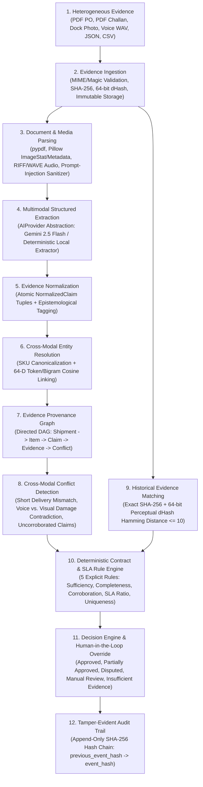

# EvidenceOS Architecture (`docs/architecture.md`)

## 1. Platform vs. Vertical Product Positioning

- **EvidenceOS** is the horizontal AI evidence verification and provenance intelligence engine. It provides multimodal ingestion, cryptographic and perceptual hashing, schema-enforced extraction, cross-modal entity resolution, conflict detection, deterministic rule evaluation, and tamper-evident audit logging.
- **VeriDock** is the first vertical application built on top of EvidenceOS, purpose-built for **B2B delivery and procurement dispute resolution**.

---

## 2. End-to-End 12-Stage Pipeline

---

## 3. Why Each Component Exists

| Module | Directory | Responsibility | Why It Exists |
| :--- | :--- | :--- | :--- |
| **Ingestion** | `core/ingestion/` | Validates file extensions and magic bytes, sanitizes filenames, computes SHA-256 and 64-bit image dHash, and writes raw bytes to `StorageProvider`. | Ensures original evidence is preserved immutably before any AI processing occurs. |
| **Multimodal Extraction** | `core/extraction/` & `core/ai/` | Converts PDFs, images, audio reports, CSVs, and JSON into validated Pydantic models (`DocumentExtractionResult`, `ImageAnalysisResult`, `VoiceClaimExtraction`). | Bridges unstructured human/warehouse artifacts and structured reasoning without allowing free-form LLM text into business logic. |
| **Evidence Normalization** | `core/normalization/` | Transforms modality-specific outputs into atomic `NormalizedClaim` records (`entity_key`, `attribute`, `value`, `epistemic_type`, `provenance`). | Allows downstream conflict detection and rule evaluation to operate uniformly across PDFs, photos, and audio. |
| **Entity Resolution** | `core/entities/` | Connects line items across PO, Delivery Challan, Dock Photo, and Voice transcript into `ResolvedEntity` records. | Solves the cross-modal grounding problem so claims about `"SKU-IND-100"` in a PDF and `"two crushed boxes"` in audio link to the same item. |
| **Evidence Graph** | `core/evidence/` | Builds a serializable DAG (`EvidenceGraph`) of nodes and directed edges. | Enables both visual inspection in the UI and programmatic traversal from a final decision back to raw files. |
| **Conflict Detection** | `core/conflicts/` | Compares competing claims on the same `(entity_key, attribute)` across modalities. | Surfaces contradictions (e.g., Voice says 5 damaged vs. Image shows 2 damaged) rather than silently averaging or ignoring them. |
| **Historical Matching** | `core/matching/` | Compares SHA-256 hashes and 64-bit perceptual dHashes against prior cases. | Detects exact or visually perturbed reused photos across claims using neutral language (`"Potentially reused evidence detected."`). |
| **Rule & Decision Engine** | `core/rules/` & `core/decisions/` | Evaluates 5 deterministic contract/SLA rules and computes settlement adjustments. | Guarantees arithmetic, thresholds, and final outcomes are 100% deterministic and auditable. |
| **Audit Trail** | `core/audit/` | Chains every case event with SHA-256 hashes (`previous_event_hash` → `event_hash`). | Provides cryptographic tamper-evidence for compliance and post-dispute audits. |
