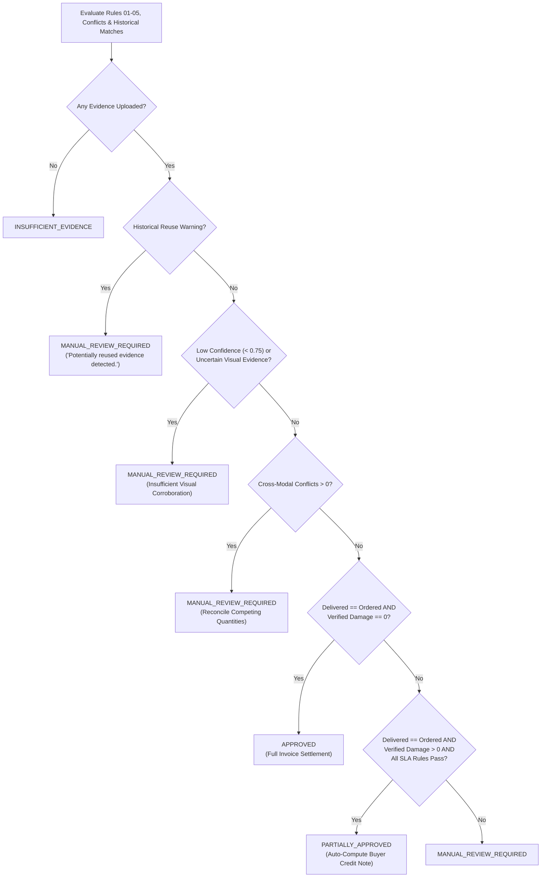

# Deterministic Rules & Decision Engine (`docs/decisions.md`)

## 1. Contract & SLA Rules (`core/rules/engine.py`)

VeriDock evaluates five explicit, deterministic rules over resolved entities, conflicts, and historical matches:

1. **`RULE_01_EVIDENCE_SUFFICIENCY`** (*Evidence Completeness & Confidence Threshold*):
   - Verifies that primary documents exist, no evidence item has `epistemic_type == UNCERTAINTY`, and `min_observed_confidence >= min_confidence_threshold` (default `0.75`).
2. **`RULE_02_DELIVERY_COMPLETENESS`** (*Purchase Order vs. Delivery Challan Match*):
   - Verifies `ordered_quantity == delivered_quantity`. Flags any short delivery.
3. **`RULE_03_CROSS_MODAL_DAMAGE_CORROBORATION`** (*Multi-Modal Physical Damage Corroboration*):
   - Requires that any positive damage claim (`> 0`) be corroborated across visual inspection (`inspection_image`) and receiving reports (`voice_report` / `delivery_challan`) without contradiction.
4. **`RULE_04_CONTRACT_SLA_THRESHOLD`** (*Contract SLA Maximum Auto-Approval Damage Ratio*):
   - Verifies that $\frac{\text{verified\_damaged\_quantity}}{\text{ordered\_quantity}} \le \text{sla\_max\_damage\_ratio}$ (default `0.25` or `25%`).
5. **`RULE_05_HISTORICAL_EVIDENCE_UNIQUENESS`** (*Cryptographic & Perceptual Historical Uniqueness Check*):
   - Verifies `len(historical_warnings) == 0` across SHA-256 exact match and 64-bit perceptual dHash Hamming distance ($\le 10$).

---

## 2. Decision State Machine (`core/decisions/engine.py`)

---

## 3. Human-in-the-Loop Override Workflow

Uncertain or conflicting cases never silently guess a payout. Instead, human procurement adjudicators can submit a review via `POST /api/cases/{case_id}/review` (or the **Human Adjudicator Review & Override** panel in the UI), recording:
- `outcome` (`approved`, `partially_approved`, `disputed`, `manual_review_required`)
- `reviewer` identifier
- `accepted_quantity` & `verified_damaged_quantity`
- `notes` (mandatory rationale appended to the SHA-256 hash-chained audit trail)
